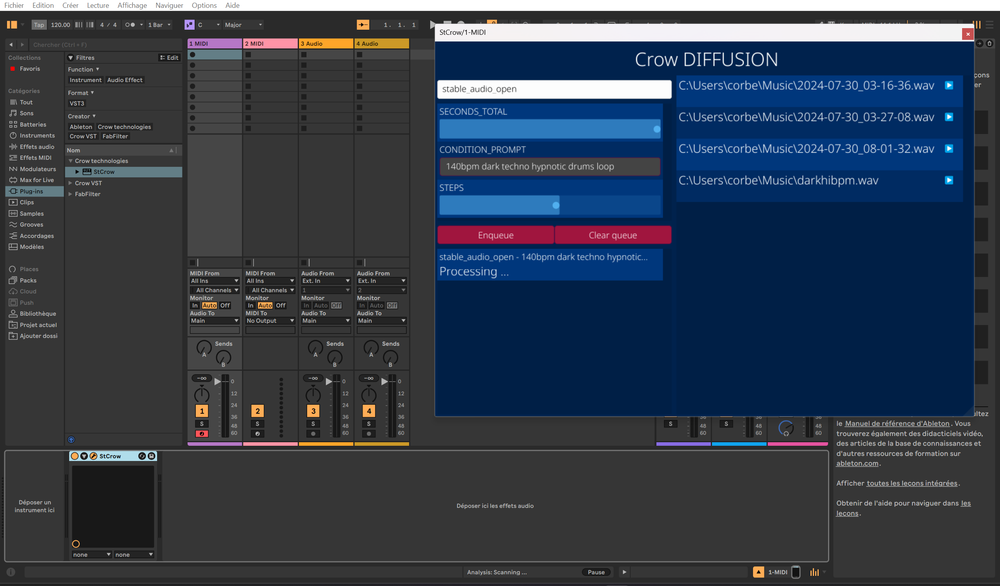

# audio-gen-exp
A Rust library for local execution of Facebook's AudioCraft models, primarily designed for audio plugin development and experimentation with generative audio.

## Overview

`audio-gen-exp` provides a bridge between Rust applications and Facebook's AudioCraft models, specifically focusing on MusicGen. It's designed to facilitate the development of audio plugins and software that leverage AI-generated audio.

### Showcase

Here is a showcase of the library in action within a simple VST3 audio plugin that generates audio based on text prompts and outputs the audio either to a file or directly to the VST3 host.
While currently limited in features, this serves as an experimental proof-of-concept to demonstrate the library's capabilities and potential.


## Features

- Local execution of various MusicGen models:
  - MusicGen Small
  - MusicGen Medium
  - MusicGen Large
  - MusicGen Melody
  - MusicGen Song Starter
- Audio processing utilities
- Async execution engine
- Embedding Conda environment management
- Real-time audio node processing

## Prerequisites

- Rust (latest stable)
- Conda or Miniconda
- CUDA-capable GPU (recommended)
- Python 3.9+

## Installation

1. Add to your Cargo.toml:
```toml
[dependencies]
crovai = "0.1.0"
```

## Usage

### Basic Example

```rust
use crovai::prelude::*;

async fn generate_audio() -> CaResult<()> {
    let executor = CondaExecutor::init(PathBuf::from("cache")).await?;
    let models = executor.get_available_diffusion_model().await?;
    let template = executor.get_diffusion_model_template("MusicGenSmall").await?;
    let assets = executor.process_diffusion_model(template, output_dir).await?;
    Ok(())
}
```

### Audio Node Processing

```rust
use crovai::audio::NodeHost;

fn process_audio() -> CaResult<()> {
    let mut host = NodeHost::new();
    let sample = RawAudioSample::Mono(vec![/* audio data */]);
    
    host.load(sample)?;
    host.fill(&mut buffer)?;
    
    Ok(())
}
```

## Architecture

The library consists of several key components:

1. **Engine Module**: Handles model execution and Conda environment management
2. **Audio Module**: Provides real-time audio processing capabilities
3. **Error Handling**: Comprehensive error system for robust application development

## Development Status

This library is currently in experimental status and is primarily used for research and development of audio plugins. APIs may change without notice.

## License

[License details here]

## Contributing

This is a development-purpose library. Feel free to fork and experiment, but note that it's primarily designed for personal research and experimentation.

## Acknowledgments

- Facebook AudioCraft Team
- Rust Audio Community
